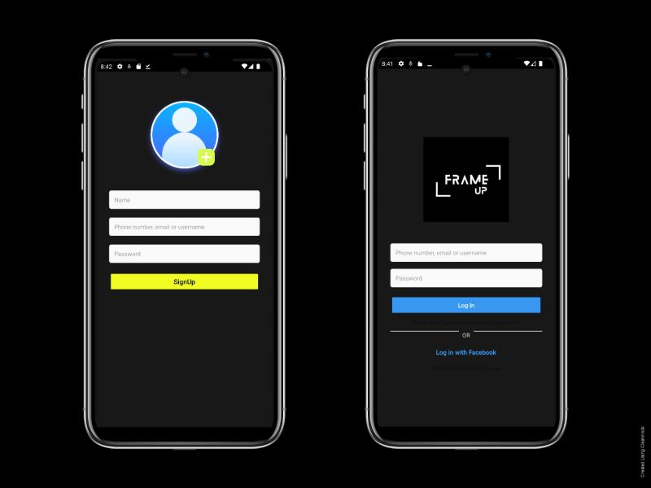
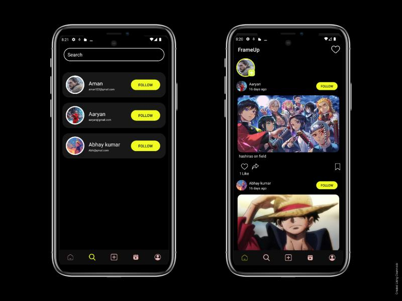
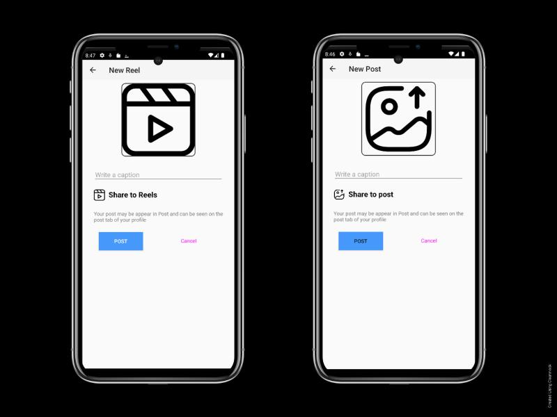

# FrameUp 📸🎥

**FrameUp** is a social media Android application that lets users **share images and videos**, **connect with friends**, and **explore content from others**.  
It is built to be simple, fast, and fun — aimed at fostering connections through visual content. 

---

## 📌 Features

✅ Upload and share **photos and videos**  
✅ Explore and connect with other users  
✅ User profiles with content feed  
✅ Smooth and responsive UI  
✅ Built using Kotlin for Android

---

## 📸 App Screenshots

### Login Screen

### Home Feed

### Upload Screen

### User Profile

